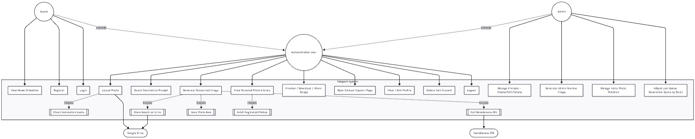
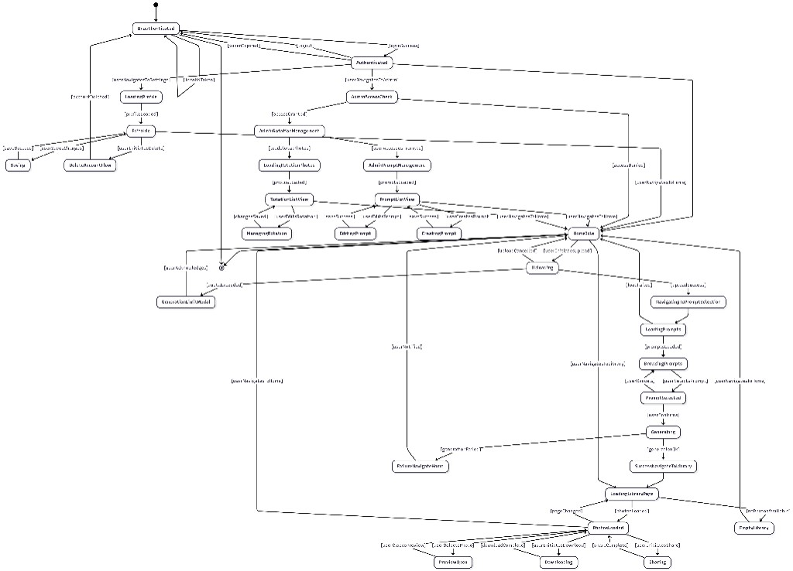
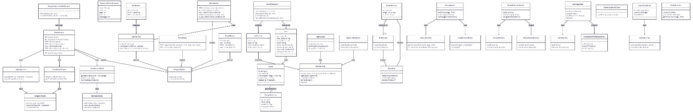
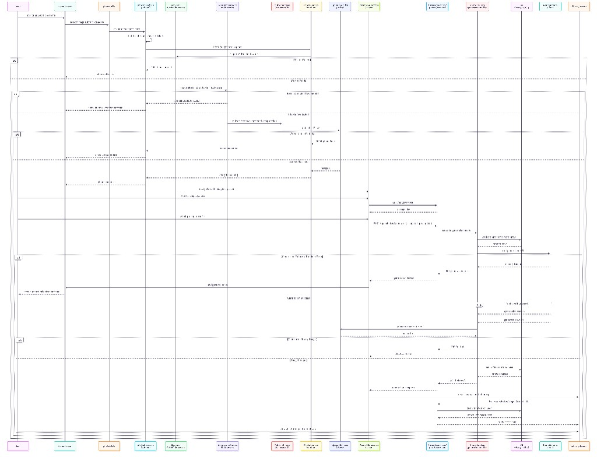

# Dokumentacija programa — Teleportation App

**Verzija:** 1.0  
**Repozitorij:** [Teleportation-app](https://github.com/Doki39/Teleportation-app)

---

## Sadržaj

1. [Opis aplikacije](#1-opis-aplikacije)  
2. [Prototip korisničkog sučelja](#2-prototip-korisničkog-sučelja)  
3. [Use case model](#3-use-case-model)  
4. [Konceptualni model (klase / entiteti)](#4-konceptualni-model-klase--entiteti)  
5. [Specifikacija REST API-ja](#5-specifikacija-rest-api-ja)  
6. [Upute za korištenje aplikacije](#6-upute-za-korištenje-aplikacije)  
7. [Tehnologije i okruženje](#7-tehnologije-i-okruženje)  
8. [Literatura](#8-literatura)

---

## 1. Opis aplikacije

### 1.1. Namjena

Aplikacija **Teleportation App** namijenjena je krajnjem korisniku koji želi od vlastite fotografije i odabranog „odredišta” (unaprijed definiranog tekstualnog prompta koji je skriven iza slike prikazane u sučelju) dobiti novu, generiranu sliku. Sustav poziva vanjski servis za generiranje slike (*image-to-image*; to znači da se uzima slika i mijenja sadržaj izvan objekta, u ovom slučaju osobe na slici), rezultat pohranjuje u cloud servis, u ovom slučaju Google Drive, a putanja (URL) te slike sprema se u bazu podataka te se preko istog URL-a prikazuje u osobnoj biblioteci korisnika.

### 1.2. Glavne značajke

- **Autentikacija:** registracija i prijava; identitet poslije prijave potvrđuje se JWT tokenom u zaglavlju zahtjeva.
- **Prijenos fotografije:** izvorna datoteka šalje se na poslužitelj, komprimira se ako je veća od zadanog uvjeta, a zatim se sprema na Google Drive.
- **Odabir odredišta:** skup aktivnih odredišta dolazi iz tablice `prompt_selection` (naslov, tekst prompta za model, pregledna slika).
- **Generiranje i biblioteka:** obrada preko vanjskog API-ja (NanoBanana); zapis u tablici `photos` (vezan uz korisnika); lista u aplikaciji s mogućnošću pregleda, preuzimanja i dijeljenja.
- **Ograničenje generacija:** običnim korisnicima dopušten je ograničen broj zapisa u `photos` (postavljeno je 3), koji može biti povećan poljem `bonus_generations`, a koje administracija dodjeljuje preko e-maila korisnika u admin sučelju; uloga administratora nije ograničena tim pravilom (provjera kvote prije prijenosa na ruti `POST /api/photos/upload`).
- **Javni slideshow na početnoj:** kratki prikaz slika generiranih aplikacijom iz tablice `photo_rotation` (bez prijave).
- **Administracija:** upravljanje promptovima (CRUD), dodjela bonus generacija po e-mail adresi, upravljanje stavkama slideshowa (dodavanje s nedavnih generacija, brisanje).

### 1.3. Arhitektura (pregled)

- **Klijent:** Expo (React Native), jedna zajednička baza koda za Android, iOS i web. Aplikacija je namijenjena za web, ali je prilagođena i za iOS i Android sustave u slučaju budućeg deploymenta.
- **Poslužitelj:** Node.js, Express, moduli u ES formatu (`"type": "module"`).
- **Baza:** PostgreSQL, veza putem paketa `pg` (connection pool).
- **Integracije:** Google Drive (pohrana), vanjski generativni servis slika, JWT tajna za potpis tokena.

---

## 2. Prototip korisničkog sučelja

U ovom poglavlju dan je **opis prototipa korisničkog sučelja**, odnosno pregled ekrana, njihove namjene i međusobne navigacije. Naglasak je na funkcionalnoj organizaciji sučelja: koji zasloni postoje, čemu služe i na koji se način korisnik kreće kroz sustav. Vizualni UML dijagrami priloženi su u kasnijim poglavljima dokumentacije.

### 2.1. Hijerarhija navigacije (korisnik)

| Zaslon | Svrha |
|--------|--------|
| **Početna (Home)** | Naslov, animirani vizual; gostu poruka za prijavu; prijavljenom raketa (kamera), gumbi „Upload iz galerije“, „Biblioteka“, adminu „Admin panel“; slideshow „Gdje su ljudi putovali s nama“. |
| **Prijava / Registracija** | Unos e-maila i lozinke; registracija s imenom, prezimenom, telefonom. |
| **Biblioteka** | Straničena mreža generiranih slika; dodir otvara pregled i preuzimanje. |
| **Odabir odredišta (prompt)** | Kružni / kotač odabira; potvrda pokreće generiranje. |
| **Postavke** | Izmjena profila, odjava, brisanje računa (gdje je implementirano). |
| **Kontakt / podrška** | (Ako je uključen u `AppStack`.) |

### 2.2. Navigacija administratora

Ugniježđeni **Admin panel** (`AdminStack`):

| Zaslon | Svrha |
|--------|--------|
| **Admin (nadzorna ploča)** | Bonus generacija (e-mail + vrijednost); poveznica na upravljanje promptovima. |
| **Upravljanje promptovima** | Ulaz u kreiranje postojećih / novih promptova i **upravljanje rotacijom** slideshowa. |
| **Rotacija (slideshow)** | Popis trenutnih stavki `photo_rotation` s uklanjanjem; mreža zadnjih N generacija s gumbom „Dodaj u rotaciju“ i unosom lokacije. |
| **Kreiranje / uređivanje prompta** | Obrasci unosa naslova, teksta prompta, slike. |

### 2.3. Prototip tijeka: generacija jedne slike

1. Korisnik se prijavi.  
2. Na početnoj pokrene kameru ili odabir iz galerije.  
3. Aplikacija šalje sliku na `POST /api/photos/upload` (uz provjeru kvote).  
4. Otvara se zaslon odabira odredišta; korisnik odabire prompt i potvrđuje.  
5. Aplikacija šalje `POST /api/photos/generate` s `imageUrl` i `promptId`.  
6. Poslužitelj dohvaća tekst prompta, poziva generiranje, pohranjuje rezultat, vraća zapis `photos`.  
7. Korisnik se preusmjerava na biblioteku ili vidi ažuriranu listu.

---

## 3. Use case model

### 3.1. Aktori

- **Gost** — neprijavljen korisnik.  
- **Korisnik** — registrirani korisnik s ulogom `user`.  
- **Administrator** — korisnik s ulogom `admin`.  
- **Vanjski sustavi** — PostgreSQL, Google Drive API, NanoBanana API.

### 3.2. Use case dijagram

Sljedeći dijagram prikazuje glavne aktere sustava i njihove funkcionalnosti.

**Slika 1.** Use case dijagram prikazuje razliku između mogućnosti gosta, registriranog korisnika i administratora. Gost može samo pregledavati javni dio sustava, dok prijavljeni korisnik dobiva pristup prijenosu fotografija, generiranju i biblioteci. Administrator, uz sve korisničke funkcije, dobiva dodatne mogućnosti za održavanje promptova, upravljanje slideshow rotacijom i dodjelu dodatnih generacija.

### 3.3. Kratki opis ključnih slučajeva

| Slučaj | Preduvjet | Osnovni tijek |
|--------|-----------|---------------|
| Registracija | — | Validacija unosa, hash lozinke, unos u `users`, vraćanje JWT. |
| Prijava | Aktivan račun | Provjera e-maila i lozinke, izdavanje JWT. |
| Prijenos slike | Prijava, provjera kvote | Multipart zahtjev, upload na Drive, vraćanje `imageUrl`. |
| Generiranje | Prijava, valjan `promptId` | Dohvaćanje prompta, poziv modela, insert u `photos`. |
| Slideshow | — | Javni GET liste `photo_rotation`. |

### 3.4. Dijagram stanja

Za prikaz promjene stanja aplikacije, korisnika i ključnih procesa izrađen je dijagram stanja.

**Slika 2.** Dijagram stanja prikazuje prijelaze između osnovnih stanja sustava: neprijavljen korisnik, autentikacija, administratorski pristup, prijenos slike, generiranje, pregled promptova i prikaz rezultata. Ovakav prikaz koristan je jer pokazuje koje su funkcionalnosti uvjetovane prijavom i ulogom korisnika.

---

## 4. Konceptualni model (klase / entiteti)

Aplikacija je u JavaScriptu; **domenski model** prikazan je konceptualno (UML-pojmovne klase / ER u jednom prikazu).

### 4.1. Dijagram klasa (domenski pojmovi)

**Slika 3.** Dijagram klasa prikazuje ključne domenske entitete projekta: korisnika, generiranu fotografiju, odredište iz kataloga promptova i stavku slideshow rotacije. U središtu modela nalazi se entitet korisnika, uz kojeg su vezane generirane fotografije, dok se promptovi i rotacija koriste kao pomoćni sadržajni sloj aplikacije.

\*U kodu se prilikom generiranja koristi `promptId` koji je „skriven” iza slike, odnosno prompta koji korisnik odabere. Iz baze se dohvaća prompt i šalje zajedno sa slikom na NanoBanana API, koji vraća generirani `taskId`, preko kojeg se zatim dohvaća slika.

### 4.2. Poslužiteljski slojevi (ne domenske klase)

Ekspresni **ruteri** i **servisi** (`userService`, `uploadService`, `driveMediaService`, `nano-banana.js`) predstavljaju aplikacijsku i infrastrukturnu logiku, ne tablice.

### 4.3. Sekvencijski dijagram glavnog scenarija

Glavni scenarij rada sustava jest prijenos slike, odabir prompta i generiranje rezultata. Sekvencijski dijagram u nastavku prikazuje razmjenu poruka između korisničkog sučelja, backend poslužitelja, baze podataka i vanjskih servisa.

**Slika 4.** Sekvencijski dijagram pokazuje redoslijed poziva u tipičnom toku rada: korisnik šalje sliku, backend provjerava autorizaciju i kvotu, pohranjuje datoteku, dohvaća prompt, poziva servis za generiranje, sprema rezultat te ga vraća klijentu za prikaz u biblioteci.

---

## 5. Specifikacija REST API-ja

Baza putanje: `{API_BASE_URL}/api/...`  
Autentikacija: za zaštićene rute zaglavlje `Authorization: Bearer <JWT>`.

### 5.1. Autentikacija — ` /api/auth`

| Metoda | Ruta | Autentikacija | Opis |
|--------|------|---------------|------|
| POST | `/api/auth/register` | Ne | Registracija. Tijelo JSON: `first_name`, `last_name`, `email`, `phone_number`, `password` (min. 8 znakova). Odgovor 201: `token`, `user`. |
| POST | `/api/auth/login` | Ne | Prijava. Tijelo: `email`, `password`. Odgovor 200: `token`, `user` (bez `password_hash`). |

### 5.2. Korisnik — `/api/users`

| Metoda | Ruta | Autentikacija | Opis |
|--------|------|---------------|------|
| GET | `/api/users/me` | Bearer | Vraća `{ user }` za trenutnog korisnika. |
| PATCH | `/api/users/me` | Bearer | Izmjena profila. Obavezno `current_password`. Polja: `first_name`, `last_name`, `email`, `phone_number` (opcijska kombinacija). |
| DELETE | `/api/users/me` | Bearer | Brisanje računa. Tijelo: `{ "password": "..." }`. Odgovor 204. |

### 5.3. Fotografije — `/api/photos`

| Metoda | Ruta | Autentikacija | Opis |
|--------|------|---------------|------|
| GET | `/api/photos` | Bearer | Paginirana biblioteka. Upiti: `page` (zad. 1), `limit` (zad. 10, max 100). Administrator vidi sve fotografije; korisnik samo vlastite. Odgovor: `{ items, total, page, limit, totalPages }`. |
| GET | `/api/photos/slides` | Ne | Javna lista zapisa `photo_rotation` za slideshow. |
| GET | `/api/photos/drive-media/:fileId` | Ne | Streaming sadržaja datoteke s Google Drivea (proxy); `fileId` saniran protiv umetanja puta. |
| POST | `/api/photos/upload` | Bearer + kvota | Slanje polja `image`. Middlewarei: kvota generacija, multer, moguća kompresija. Vraća `{ imageUrl }`. |
| POST | `/api/photos/upload-local` | Admin | Isto za učitani buffer; privremeni admin API za slike na Driveu. |
| POST | `/api/photos/generate-preview` | Admin | JSON: `imageUrl`, `modifyText` — test generacija za admina; vraća `{ processedUri }`. |
| POST | `/api/photos/generate` | Bearer | JSON: `imageUrl`, `promptId`. Dohvaća `prompt` iz baze, generira, insert u `photos`. 201 + zapis; 409 ako je duplikat prema ograničenju baze. |

### 5.4. Prompt odredišta — `/api/prompts`

| Metoda | Ruta | Autentikacija | Opis |
|--------|------|---------------|------|
| GET | `/api/prompts` | Bearer | Svi zapisi `prompt_selection`. |
| POST | `/api/prompts` | Admin | Kreiranje: `title`, `prompt`, `image_url`. |
| PATCH | `/api/prompts/:id` | Admin | Izmjena `title`, `prompt`, `image_url` (što je poslano). |
| DELETE | `/api/prompts/:id` | Admin | Brisanje. Odgovor 204. |

### 5.5. Administracija — `/api/admin`

| Metoda | Ruta | Autentikacija | Opis |
|--------|------|---------------|------|
| PATCH | `/api/admin/users/bonus-generations` | Admin | JSON: `email`, `bonusGenerations` (cijeli broj 0–9999). Postavlja `bonus_generations` korisnika. |
| GET | `/api/admin/photo-rotation` | Admin | Lista `photo_rotation` (`id`, `image_url`, `location`). |
| POST | `/api/admin/photo-rotation` | Admin | JSON: `imageUrl`, `location`. Novi red u `photo_rotation`. |
| DELETE | `/api/admin/photo-rotation/:id` | Admin | Brisanje stavke slideshowa. Odgovor 204. |

### 5.6. Ostalo

| Metoda | Ruta | Opis |
|--------|------|------|
| GET | `/api/db-health` | Test veze s bazom (`SELECT 1`). |
| GET | `/` | Tekstualni odgovor živosti poslužitelja. |

**Uobičajene greške:** `400` (validacija), `401` / `403` (autentikacija / zabrana), `404`, `409` (konflikt), `500` (unutarnja greška).

---

## 6. Upute za korištenje aplikacije

### 6.1. Krajnji korisnik

1. Instalirajte Expo klijent ili otvorite web inačicu prema uputama razvojnog tima (`expo start` / `--web`).  
2. Pokrenite **registraciju** ako nemate račun; prijavite se **prijavom**.  
3. Na **početnoj** odaberite **raketu (kamera)** ili **prijenos iz galerije**. Uzmite ili odaberite fotografiju i pričekajte završetak prijenosa.  
4. Na zaslonu **odabira odredišta** pomicanjem odaberite željeno mjesto, zatim potvrdite generiranje.  
5. Otvorite **biblioteku** za pregled i preuzimanje generiranih slika. Broj generacija može biti ograničen; pri prekoračenju sustav prikazuje poruku (npr. prilikom prijenosa).  
6. U **postavkama** možete ažurirati profil ili obrisati račun.

### 6.2. Administrator

1. Račun mora imati ulogu `admin` u bazi.  
2. Na početnoj odaberite **Admin panel**.  
3. **Bonus generacija:** unesite e-mail korisnika i broj dodatnih generacija (na postojeću bazu od 3) te spremite.  
4. **Upravljanje promptovima:** kreirajte, mijenjajte ili brišite odredišta (naslov, tekst za model, URL pregleda).  
5. **Rotacija (slideshow):** pregledajte trenutne stavke i uklonite neželjene. Od nedavnih generacija dodajte sliku u slideshow unosom **lokacije** (oznaka prikazana javno na početnoj).

### 6.3. Razvojno pokretanje

**Poslužitelj (`backend/`):**  
`cd backend` → `npm install` → podesiti `.env` (`DATABASE_URL`, `JWT_SECRET`, ključeve za Drive i NanoBanana, …) → `npm start` ili `npm run dev`.

**Klijent (`frontend/SP`):**  
`npm install` → postaviti `EXPO_PUBLIC_API_BASE_URL` na adresu API-ja → `npx expo start`.

---

## 7. Tehnologije i okruženje

| Područje | Tehnologija |
|----------|-------------|
| Klijent | Expo ~54, React 19, React Native, React Navigation, expo-router (korijenski layout) |
| Poslužitelj | Node.js, Express 5, express-validator, multer, bcrypt, jsonwebtoken, pg, googleapis |
| Baza | PostgreSQL |
| Oblasni kod | JavaScript ES moduli |

Varijable okruženja (nepotpuni popis): `DATABASE_URL`, `JWT_SECRET`, `PORT`, `CORS_ORIGIN`, `NANOBANANA_API_KEY`, `DRIVE_UPLOAD_FOLDER_ID`, `PUBLIC_API_BASE_URL`, `EXPO_PUBLIC_API_BASE_URL`, `GOOGLE_APPLICATION_CREDENTIALS` (lokalna JSON putanja, opcionalno), za učitavanje istog JSON-a s S3 na udaljenom poslužitelju: `AWS_GOOGLE_CREDENTIALS_BUCKET` ili `AWS_S3_BUCKET` / `AWS_S3_BUCKET_NAME`, `GOOGLE_CREDENTIALS_OBJECT_KEY` (zadano `teleportation-app-c7f4fbfab6d8.json`), `AWS_ACCESS_KEY_ID`, `AWS_SECRET_ACCESS_KEY`, `AWS_REGION` / `AWS_DEFAULT_REGION`, opcionalno `AWS_ENDPOINT_URL` (kompatibilni S3).

---

## 8. Literatura

- Izvršni izvorni kod projekta: repozitorij **Teleportation-app**.  
- Službena dokumentacija: [Expo](https://docs.expo.dev/), [Express](https://expressjs.com/), [PostgreSQL](https://www.postgresql.org/docs/).

---
